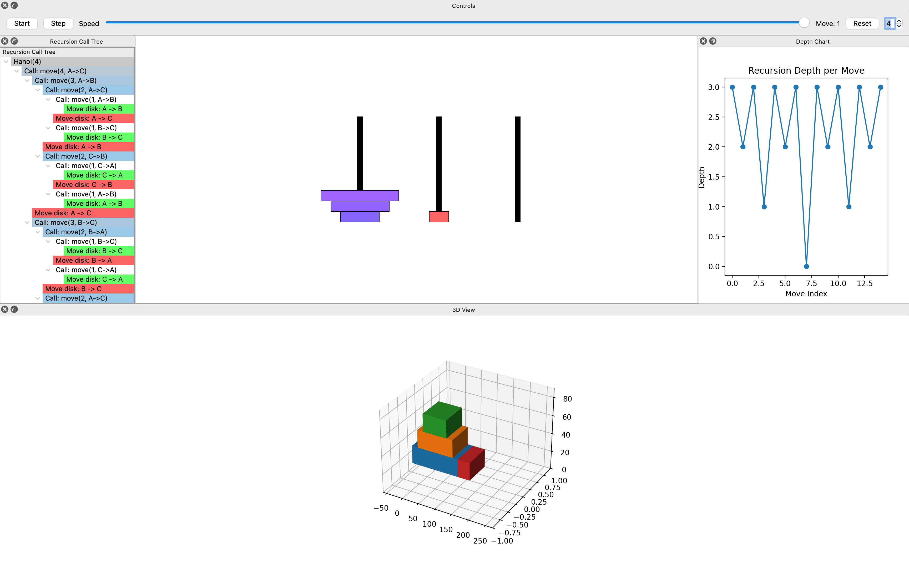
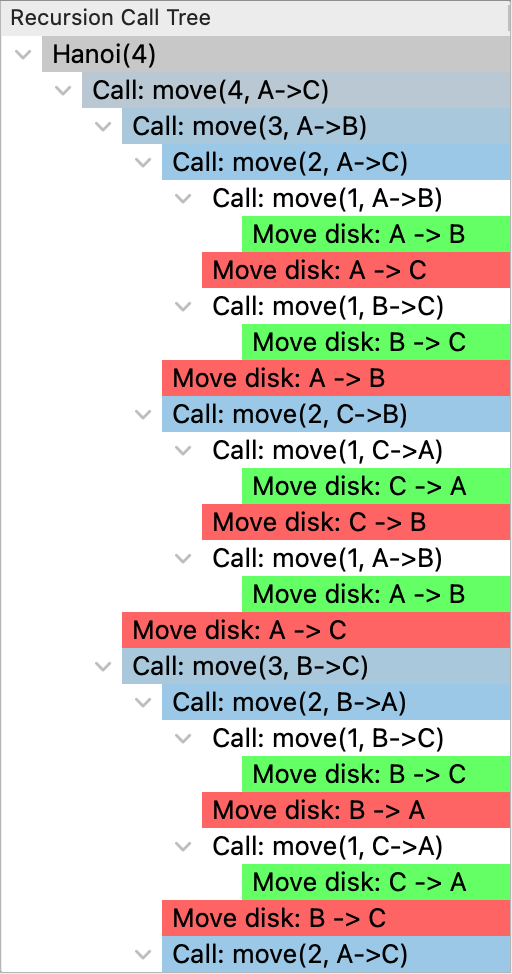
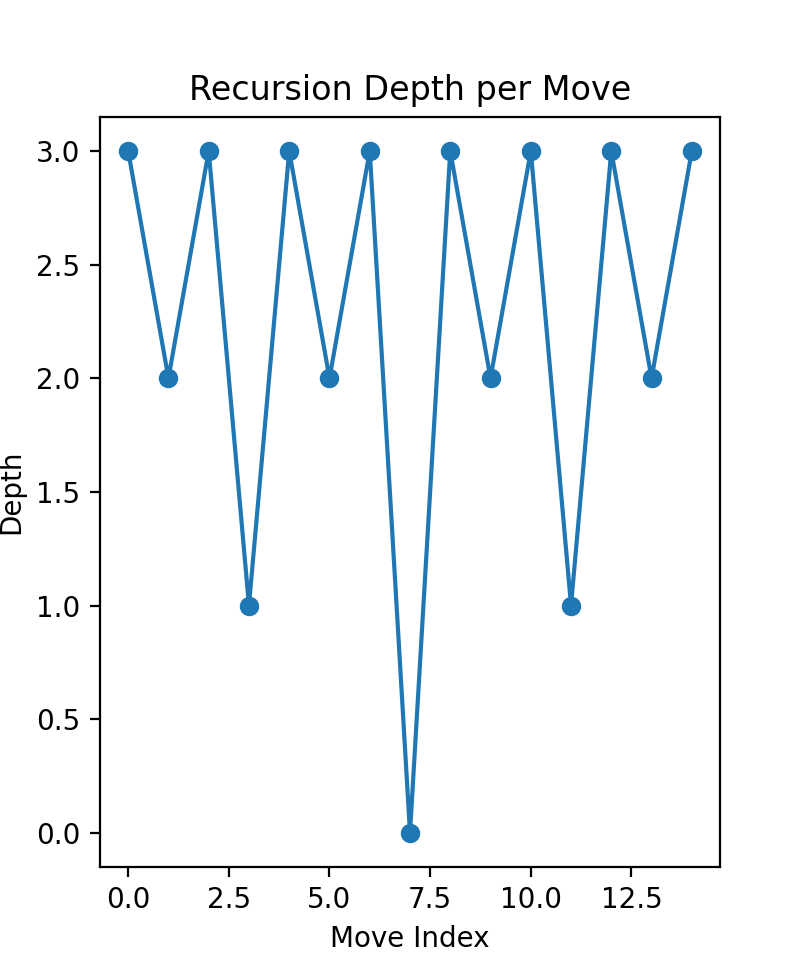

# HanoiVisualizer3D

An interactive Tower of Hanoi visualizer built with PyQt6, featuring both 2D and 3D animated views, a recursion call tree, and a depth chart.

## Features

* **2D Animation**: Watch disks move in real time on a QGraphicsView.
* **3D Visualization**: Matplotlib 3D bar charts.
* **Recursion Call Tree**: Expandable tree view of recursive calls and disk moves.
* **Depth Chart**: Matplotlib chart plotting recursion depth over each move.
* **Controls**:
  * **Start**: Run full animation automatically.
  * **Step**: Perform one move at a time.
  * **Speed Slider**: Adjust animation interval between moves.
  * **Move Counter**: Track current move number.
  * **Reset**: Clear the board and start over.
  * **Disk Selector**: Choose number of disks (1–10).

## Requirements

- Python 3.10 or higher
- PyQt6 (Qt GUI bindings)
- Matplotlib (for 2D/3D plotting)

Install base dependencies:

```bash
python -m venv .venv
source .venv/bin/activate  # Windows: .venv\Scripts\activate
python -m pip install --upgrade pip
pip install -r requirements.txt
```

Notes:
- On macOS, run from Terminal/iTerm (not Code Runner) and ensure VS Code uses your venv interpreter.

Developer setup (editable install, tests, Makefile):

- From this folder (HanoiVisualizer3D):
  - Editable install with test extras: `pip install -e '.[test]'`
  - Or use the Makefile:
    - `make venv`
    - `make install`
    - `make run`
    - `make test`

## Screenshots

2D View:



3D View:


Recursion Call Tree:



Depth Chart:




## Usage

Run from the project directory:

```bash
# From repo root
python HanoiVisualizer3D/main.py

# Or from the subfolder
cd HanoiVisualizer3D
python main.py

# Or as a module (from repo root)
python -m HanoiVisualizer3D.main
```

Keyboard shortcuts:
- Space: Start/Pause
- N: Step once
- R: Reset

Layout tips:
- Docks are resizable: drag the borders to make the right “Depth Chart” and bottom “3D View” larger or smaller.
- The app opens with a larger window and increased default sizes for both charts for readability.

Troubleshooting:
- “ModuleNotFoundError: PyQt6” → install deps with `pip install -r requirements.txt`.
- “Qt platform plugin could not be initialized” on macOS/Linux → run from a real terminal and ensure the venv is active; try `pip install --upgrade PyQt6`.
- Blank/slow plots on first run → ensure `matplotlib` installed via the steps above.

## License

# Creative Commons Attribution-NonCommercial 4.0 International License (CC BY-NC 4.0)

**Copyright (c) 2025 Justin Guida**

This work is licensed under the **Creative Commons Attribution-NonCommercial 4.0 International License**.

You are free to:

**Share** — copy and redistribute the material in any medium or format  
**Adapt** — remix, transform, and build upon the material  

Under the following terms:

 **Attribution** — You must give appropriate credit, provide a link to the license, and indicate if changes were made. Credit must include:
- Name: *Justin Guida*
- Year: *2025*
- GitHub: [https://github.com/jguida941](https://github.com/jguida941)

 **NonCommercial** — You may not use the material for **commercial purposes** without **explicit written permission** from the author.

Additional terms:

- **You may not sell**, rebrand, or redistribute this work for profit.  
- Educational institutions and students may freely use, adapt, and build upon this work **for non-commercial academic use**, including course materials and presentations.
- Derivative works must also credit the original author clearly.

---

To view the full license, visit:  
[https://creativecommons.org/licenses/by-nc/4.0](https://creativecommons.org/licenses/by-nc/4.0)
